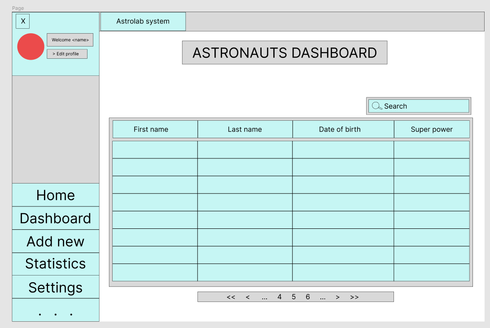
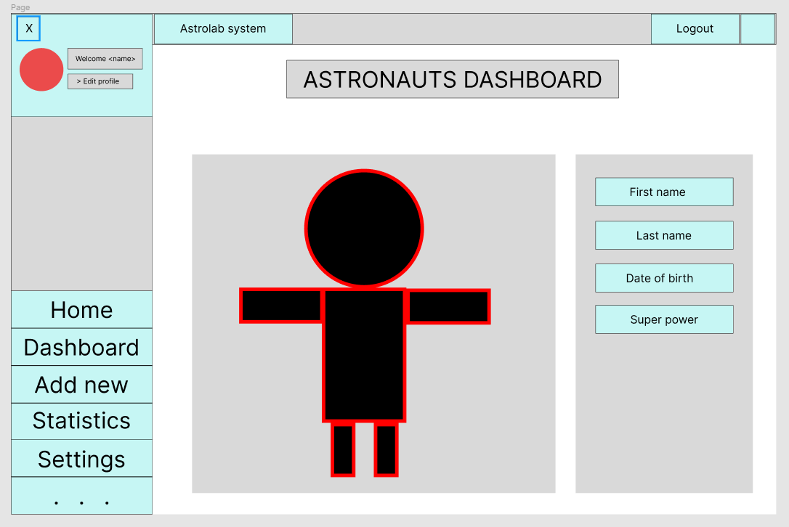
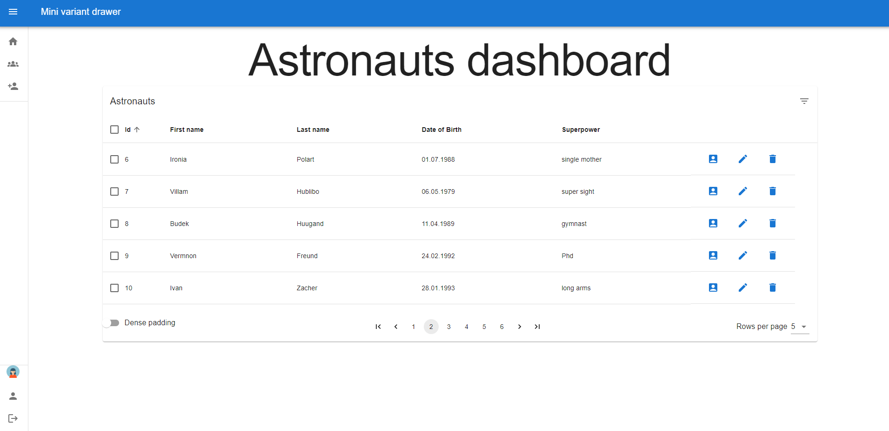
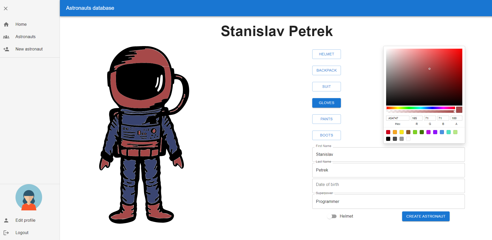

# Astronauts

This project is being developed as an assignment. It aims to visualize basic data about astronauts: 

The main focus is to provide suitable prototype with easy to navigate UI. Project aims for an easy expansion of the functionality in the future.

## Technology stack
* frontend - [React](https://reactjs.org/)
* backend - [Flask](https://flask.palletsprojects.com/en/2.1.x/)
* database - [PostgreSQL](https://www.postgresql.org/)

## To run the application locally:
For more extensive infomation-- refer to the backend/frontend README files. 

### Run backend  locally 
Run locally with following commands:
```bash
$ pipenv sync
$ pipenv shell
$ export FLASK_APP=app
$ export FLASK_ENV=development
$ flask run
``` 
### Run frontend locally 
```bash
$ yarn install
$ yarn start
```

## Frontend
### React + Typescript
I chose typed react since I like the clean code and syntax it provides. Typescript provides easier and more readable development environment and eases the testing and bug finding during the development phase.

### Material UI
Component library with pre-defined styles and component logic. I chose Material UI since it saved me time that I would need to implement every component from scratch. 

### React query
Library utilized for caching data from database for the dashboard table. React-query provides fresh and updated data on each change and prevents unnecessary request if the user request same data.

### CSS
Since the application is relatively small at the moment i used styled components and inline css for the application. 

### Axios
Library for XMLHttp requests from the browser usign Promises.

## Backend
### Python 3.9

### Flask
Flask is used for developing web applications using python, implemented on Werkzeug and Jinja2. Advantages of using Flask framework are:
* There is a built-in development server and a fast debugger provided.
* Lightweight
* Secure cookies are supported.
* Templating using Jinja2.
* Request dispatching using REST.
* Support for unit testing is built-in.

### SQL Alchemy
For the ORM I used Python SQL toolkit SQL Alchemy. It provides developer with full flexibility of SQL. It provides a full suite of well known enterprise-level persistence patterns, designed for efficient and high-performing database access, adapted into a simple and Pythonic domain language.

## Deployment
Application is deployed on Vercel. Backend runs on private server since I had troubles deploying it on Heroku. 

## Future improvements
There are plenty of improvements to be done. Some already prepared features which are half implemented for providing an example. 
* Documentation--update README.md for more thorough and easy to navigate app documentation
* Login--for both administrator and users. 
* Astronaut customization--like color of the suite, nationality, race,...
* Localization--since the application is quite small I would use custom language context. If the plans for the application are to grow exponentionally in the near future I would use i118n package. The i118n package provides clear a simple implementation of the localization for the application. 
* Many more

# Initial figma plans vs final application





